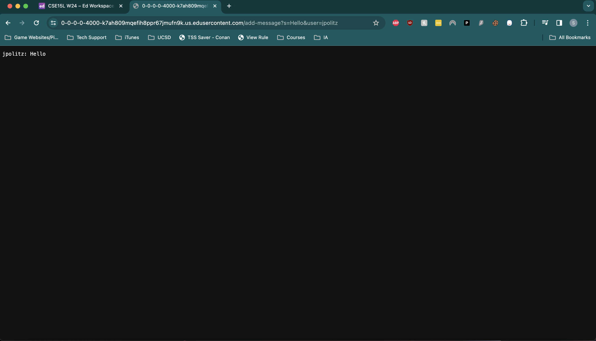

# Part 1

**The code for the `ChatServer.java` file is found below:**
```
    import java.io.IOException;
    import java.net.URI;
    import java.util.ArrayList;
    class Handler implements URLHandler{

        ArrayList<String> messages = new ArrayList<>();

        public String handleRequest(URI url){
            if(url.getPath().contains("/add-message")){
                String[] parameters = url.getQuery().split("=");
                if (parameters[0].equals("s")){
                    String[] message = parameters[1].split("&");
                    messages.add(String.format(parameters[2]+": " + message[0]).replace("+", " "));
                }
            }
            String runningString = "";
            for (String message: messages){
                runningString = String.format(runningString + message + "\n");
            }
            return runningString;
            }
        
    }


    class ChatServer{
        public static void main(String[] args) throws IOException {
            if(args.length == 0){
                System.out.println("Missing port number! Try any number between 1024 to 49151");
                return;
            }

            int port = Integer.parseInt(args[0]);

            Server.start(port, new Handler());
        }
    }
```


I ran this code on EdStem on port 4000 due to the simplicity it provided. The screenshots for adding each message are below:



- **Which methods in your code are called?**
    -  The main method obviously is running in the background, but when I added `/add-message?s=Hello&user=jpolitz`, the method being called is the `handleRequest` method. There is one parameter to the method which was of the type `URI` which is practically identical to URL.
- **What are the relevant arguments to those methods, and the values of any relevant fields of the class?**
    -   Since there is only one parameter, the argument that gets fed is `/add-message?s=Hello&user=jpolitz`. The only values in this class are a string ArrayList called `messages` which contains the exact strings that need to be displayed in the format `<User>: <Message>`. There are also 2 instance String arrays created within the method called `parameters` and `message`. There is also an instance string in the method called `runningString`. 
-  **How do the values of any relevant fields of the class change from this specific request? If no values got changed, explain why.**
    -  The `parameters` array simply takes the parameter variable `url` and calls the `getQuery()` method from the `URI` class which results in a String with the value `s=Hello&user=jpolitz` and then took that result and used the `split()` method from the `String` class and split it by "=" resulting in an array with 3 elements: `{"s", "Hello&user", "jpolitz"}`. The user is visible using the third element from this array, but the message isn't, so for the `message` array, it takes the second element and uses the `split()` method from the `String` class to split it by "&" which results in an array with 2 elements: `{"Hello", "user"}`. The first element of the `message` array is the message, and the third element of the `parameters` array is the user, so finally the `messages` ArrayList is updated with the correctly formated string using the `format()` method. Then finally, the `runningString` variable is used to store each element in the ArrayList followed by a new line and is the final variable returned  from the method.
 


- **Which methods in your code are called?**
    -  The main method obviously is running in the background, but when I added `/add-message?s=How are you&user=yash`, the method being called is the `handleRequest` method. There is one parameter to the method which was of the type `URI` which is practically identical to URL.
- **What are the relevant arguments to those methods, and the values of any relevant fields of the class?**
    -   Since there is only one parameter, the argument that gets fed is `/add-message?s=How&are&you&user=yash`. It was originally fed as `/add-message?s=How are you&user=yash`, but my browser corrected it to replace the spaces with an & symbol. The only values in this class are a string ArrayList called `messages` which contains the exact strings that need to be displayed in the format `<User>: <Message>`. There are also 2 instance String arrays created within the method called `parameters` and `message`. There is also an instance string in the method called `runningString`. 
-  **How do the values of any relevant fields of the class change from this specific request? If no values got changed, explain why.**
    -  The `parameters` array simply takes the parameter variable `url` and calls the `getQuery()` method from the `URI` class which results in a String with the value `s=How+are+you&user=yash` and then took that result and used the `split()` method from the `String` class and split it by "=" resulting in an array with 3 elements: `{"s", "How+are+you&user", "yash"}`. The user is visible using the third element from this array, but the message isn't, so for the `message` array, it takes the second element and uses the `split()` method from the `String` class to split it by "&" which results in an array with 2 elements: `{"How+are+you", "user"}`. The first element of the `message` array is the message, and the third element of the `parameters` array is the user, so finally the `messages` ArrayList is updated with the correctly formated string using the `format()` method. The plus signs were replaced with spaces using the `replace()` method. Then finally, the `runningString` variable is used to store each element in the ArrayList followed by a new line and is the final variable returned  from the method.


