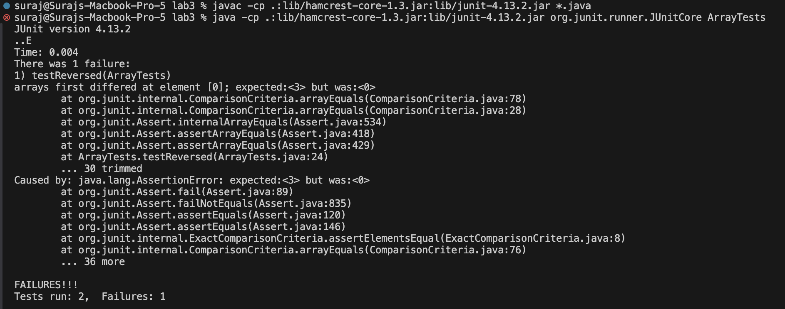

# Lab Report 3
___

## Part 1 - Bugs

I chose to debug the `reversed()` method in the `ArrayExamples` class.

- A failure-inducing input is shown below
```
@Test
  public void testReversed() {
    int[] input2 = {1,2,3};
    int[] result = ArrayExamples.reversed(input2);
    assertArrayEquals(new int[]{3,2,1}, result);
    assertArrayEquals(new int[]{1,2,3}, input2);
  }
```
- A non-failure-inducing input is shown below
```
@Test
  public void testReversed() {
    int[] input1 = { };
    assertArrayEquals(new int[]{ }, ArrayExamples.reversed(input1));
  }
```
- The output of running the two tests above is shown below


  
- The before and after of fixing the code is shown below

**Before**
```
  static int[] reversed(int[] arr) {
    int[] newArray = new int[arr.length];
    for(int i = 0; i < arr.length; i += 1) {
      arr[i] = newArray[arr.length - i - 1];
    }
    return arr;
  }
```

**After**
```
  static int[] reversed(int[] arr) {
    int[] newArray = new int[arr.length];
    for(int i = 0; i < arr.length; i += 1) {
      newArray[i] = arr[arr.length - i - 1];
    }
    return newArray;
  }
```

___

# Part 2 - Researching Commands

I chose to research the `less` command
