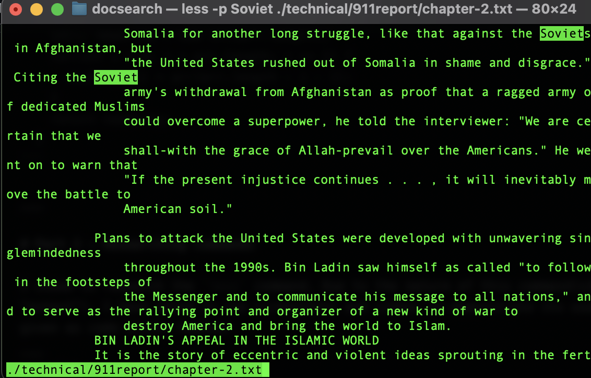
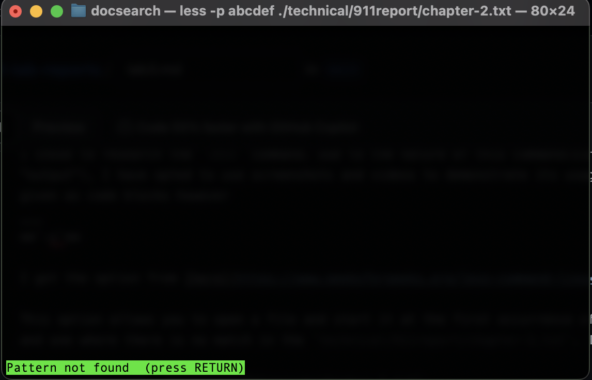
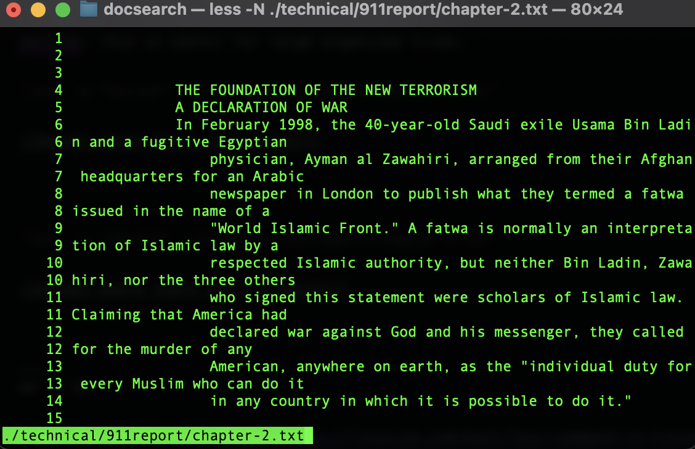
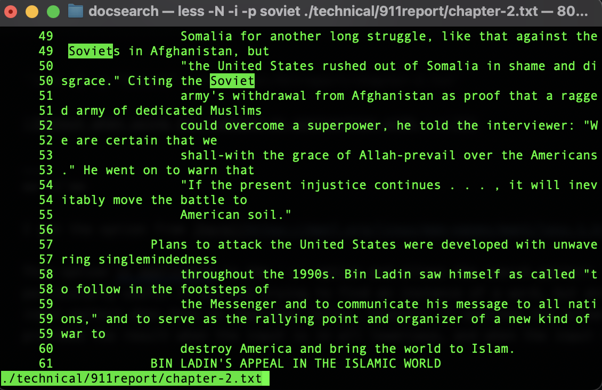
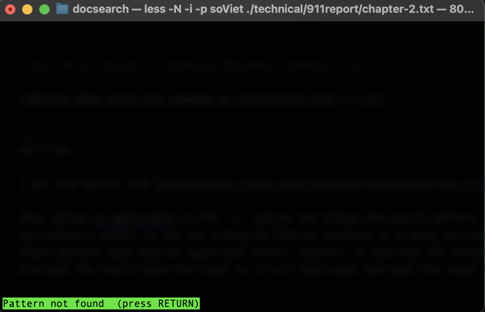
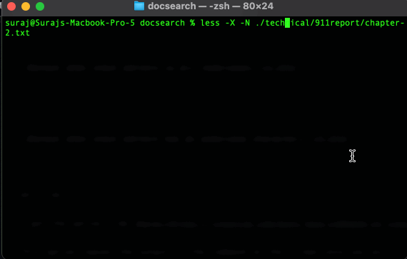

# Lab Report 3
___

## Part 1 - Bugs

I chose to debug the `reversed()` method in the `ArrayExamples` class.

- A failure-inducing input is shown below
```
@Test
  public void testReversed() {
    int[] input2 = {1,2,3};
    int[] result = ArrayExamples.reversed(input2);
    assertArrayEquals(new int[]{3,2,1}, result);
    assertArrayEquals(new int[]{1,2,3}, input2);
  }
```
- A non-failure-inducing input is shown below
```
@Test
  public void testReversed() {
    int[] input1 = { };
    assertArrayEquals(new int[]{ }, ArrayExamples.reversed(input1));
  }
```
- The output of running the two tests above is shown below


  
- The before and after of fixing the code is shown below

**Before**
```
  static int[] reversed(int[] arr) {
    int[] newArray = new int[arr.length];
    for(int i = 0; i < arr.length; i += 1) {
      arr[i] = newArray[arr.length - i - 1];
    }
    return arr;
  }
```

**After**
```
  static int[] reversed(int[] arr) {
    int[] newArray = new int[arr.length];
    for(int i = 0; i < arr.length; i += 1) {
      newArray[i] = arr[arr.length - i - 1];
    }
    return newArray;
  }
```

___

# Part 2 - Researching Commands

I chose to research the `less` command. Due to the nature of this command(since it opens up a new window to display content rather than produce an "output"), I have opted to use screenshots and videos to demonstrate its usage and output rather than as code blocks. The input commands have been given as code blocks however  
___
**`-p`**

I got the option from [here](https://www.geeksforgeeks.org/less-command-linux-examples/).

This option allows you to open a file and start it at the first occurrence of a pattern. I have two examples listed below. One where there is a match, and one where there is no match in the `technical/911report/chapter-2.txt`. I have provided the command followed by its output. This command can be useful when you are combing through a long file that is separated into sections. You could provide a pattern that is the title of a section of interest(assuming the title is in the file), and this will take you directly to that section rather than having to manually scroll and find that section. This is useful for large organized files.

`less -p "Soviet" ./technical/911report/chapter-2.txt`




`less -p "abcdef" ./technical/911report/chapter-2.txt`




___
**`-N`**

I got the option from [here](https://linuxize.com/post/less-command-in-linux/).

This option allows you to open a file and it displays the line numbers of the left. This is useful if you are combing through a large file and lets you keep track of where you are in the file relatively easily. When combined with another command like `-p`, it can be useful to determine where in the file the first occurrence of a certain pattern is. I have provided its usage when used alone and in conjunction with `-p`.


`less -N ./technical/911report/chapter-2.txt`




`less -N -p "Soviet" ./technical/911report/chapter-2.txt`


___
**`-i`**

I got the option from [here](https://man7.org/linux/man-pages/man1/less.1.html).

This option is applicable to the `-p` option and allows the search pattern to not be case-sensitive when the input is in all lowercase. This is particularly useful if you are trying to find an instance of a word, but are unsure if it is at the start of the sentence or in the middle. If the input pattern does have an uppercase letter, however, it searches the actual string you input rather than not worrying about the case. I have provided the result when the input is in all lowercase, and when the input has an uppercase character


`less -N -i -p  "soviet" ./technical/911report/chapter-2.txt`




`less -N -i -p  "soViet" ./technical/911report/chapter-2.txt`




___
**`-X`**

I got the option from [here](https://linuxize.com/post/less-command-in-linux/).

This option leaves the output of the command on the screen once you exit. This is useful if you are looking for something in a file that you need to reference in a subsequent command, especially if you use it in conjunction with the line number command `-N` where you can see the line number of a specific part you need to reference. I have provided an example where it is used by itself, and an example with `-N` used.

`less -X ./technical/911report/chapter-2.txt`


`less -X -N ./technical/911report/chapter-2.txt`


