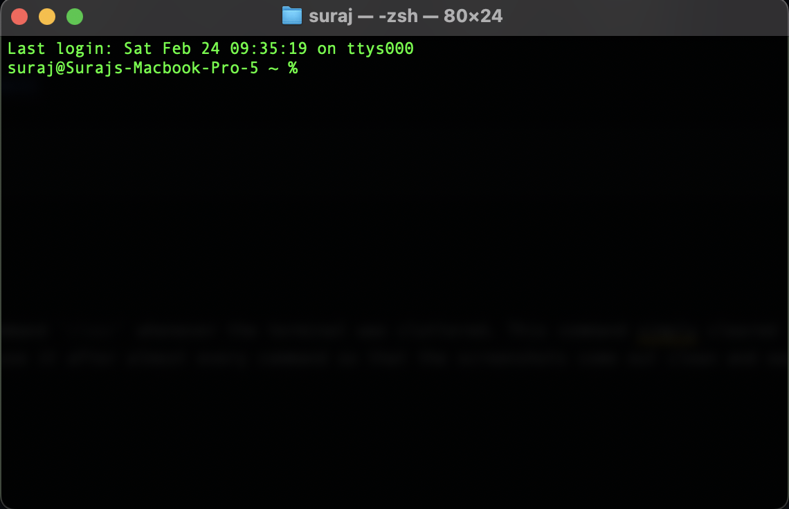
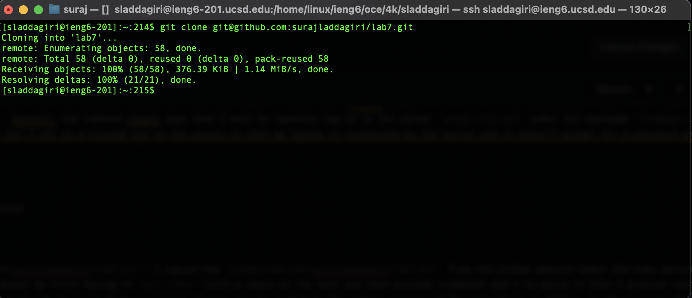
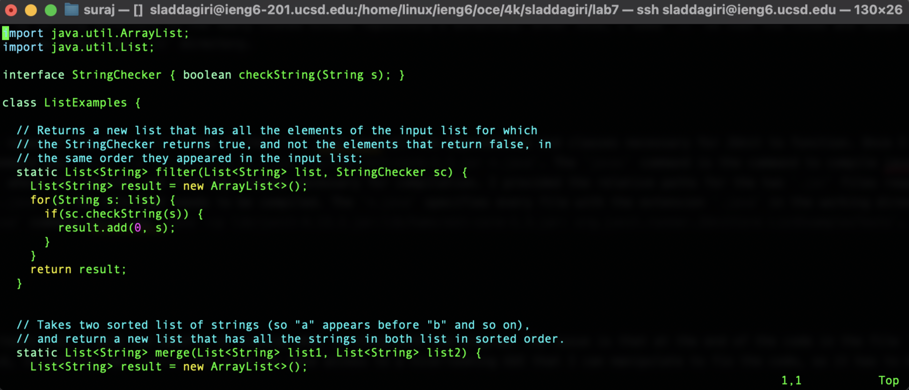
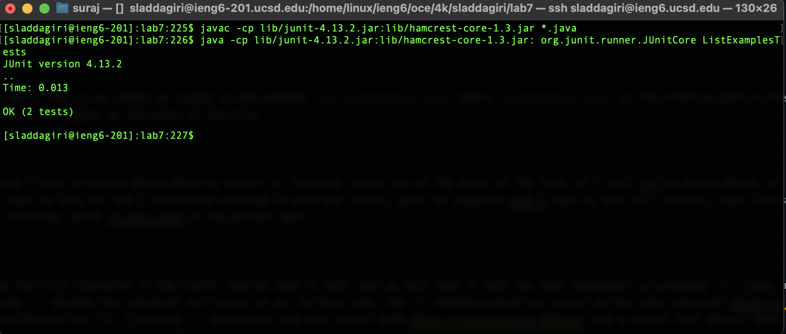

# Lab Report 4
___

Throughout this, I occasionally typed in the command `clear` whenever the terminal was cluttered. This command simply cleared the terminal window, but kept all the history. I will not be mentioning whenever I typed it since I tend to use it after almost every command so that the screenshots come out clean and easy to understand. Whenever I type in a command, I have to press `<enter>` to execute it, but I omitted it from the writeup for simplicity. I initially started off at the default terminal of my system:

___

The next step was logging into the `ieng6` server.

The command I typed to get to this point was `ssh sladdagiri@ieng6.ucsd.edu`. This command is relatively simple. The `ssh` command simply allows you to remotely connect to another computer or server through the internet. The remote server has the URL `ieng6.ucsd.edu`. the `sladdagiri@` part before that simply specifies that I want to login to the username called `sladdagiri` that is housed at the server located at `ieng6.ucsd.edu`. Overall, the command simply says that I want to remotely log in to the server `ieng6.ucsd.edu` under the username `sladdagiri`. Typically, I would need to input a password for the username, but I set up a trusted key on the server so that my laptop is recognized by the server and it doesn't prompt for a password whenever my laptop is logging in.

___

The next step is to clone the repository of interest

The command I typed was `git clone git@github.com:surajladdagiri/lab7.git`. I copied the `git@github.com:surajladdagiri/lab7.git` from the GitHub website under the Code option, followed by selecting the ssh option. I pasted it in the terminal by first typing in `git clone `(with a space at the end) and then pressed <command> and v to paste it then I pressed <enter>. This command just cloned all the contents of the repository and it set it up so that your local changes can be pushed to the online version of the repository on GitHub. I set up a private key on GitHub similar to how I set up a private key on the server. This made it so that when the server I am sshed into attempts to connect to github, it doesn't prompt for a password since it is a trusted client. This is analagous to how it was done between my laptop and the `ieng6` server.

___

The next step is to run the test program.

The first thing I did was `cd lab7` which changed my working directory to the newly cloned GitHub repository's directory. After this, I used `ls` to list the files and noted a folder called `lib` within it. I then used `ls lib` to list the files within the `lib` directory. 

Since we need to run a JUnit test, I checked the names of the two `.jar` files in the `lib` that have all the dependencies and classes necessary for JUnit to function. Once I had this, I could craft the compile and run commands. The first command was `javac -cp lib/junit-4.13.2.jar:lib/hamcrest-core-1.3.jar *.java`. The `javac` command is the command to compile java code. the `-cp` argument stands for "class path" which specifies where the compiler can find any classes necessary for compilation. I provided the relative paths for the two `.jar` files required for the code to compile split by a colon. I finally listed `*.java` as the file that needs to be compiled. The `*.java` specifies every file with the extension `.java` in the working directory. After I compiled the code, I ran the tests using the `java` command which was `java -cp lib/junit-4.13.2.jar:lib/hamcrest-core-1.3.jar: org.junit.runner.JUnitCore ListExamplesTests`. The tests then ran and the results are above.

___

The next step is to fix the program so that the tests run. I have the benefit of knowing what is wrong with the program. The issue is that at the end of the code in the file `ListExamples.java`, where the last few lines of code, `index1` should, in reality, be `index2` but I do not have access to a nice-looking GUI that I can manipulate to fix the code, so it has to be done through Vim which is a command line editor. 

First, Vim must be opened on the file we want to edit. This is as simple as typing in the command `vim ListExamples.java` where `ListExamples.java` is the relative path to the file we want to edit. In the screenshot above, it is noted that the cursor opens at the start of the file.

I then typed in `?i<enter>`. The `?` tells Vim that I want to search above where my cursor is. Since my cursor was at the start of the file, if I tell vim to search above, it wraps around and starts searching from the end. The `i` is simply what to look for and I could have replaced it with any letter, word, or sequence that I need to look for. Finally, when I pressed `<enter>`, it placed my cursor on the first instance where `i` occurred, which in this case is the perfect spot.

Finally, I typed in `exi2<esc>`. Our cursor is at the first character of the "word" that we need to edit, but we only need to edit the last character, so pressing `e`, takes us to the last character of the word we are currently on. Pressing `x` deletes the character our cursor is on. In this case, the `e` command placed our cursor on the last character which in this case was "1" and that needs to be replaced with a "2". After we deleted the "1", I pressed `i` which puts Vim into insert mode where it essentially behaves like a normal text editor. When I pressed the `x`, it deleted the "1" and moved the contents of the line to the right of where I deleted to the left by 1 spot and placed my cursor on character in the line which replaced the one I deleted, in this case, it was a space. When in insert mode, whatever you type will be placed behind where your cursor is. In this case, my cursor was on the first space after "index", so when I typed something in, it would be concatenated to "index", so when I typed in `2`, it transformed `index` into `index2`. Finally, I pressed `<esc>` which put vim back into normal mode.

After I edited the file in vim, I pressed `<shift>;wq<enter>`. The `<shift>;` was to type in `:`. When I typed `w`, it told vim to write to the file, or essentially to save my work, and finally `q` told vim to quit. I finally pressed `<enter>` which executed the two commands and brought me back to the terminal. There, I typed the sequence `<up><up><up><up><enter>` twice. The `javac -cp lib/junit-4.13.2.jar:lib/hamcrest-core-1.3.jar *.java` command was 4 up in the bash search history and I used the `<up>` key to locate it and `<enter>` to run it. The `java -cp lib/junit-4.13.2.jar:lib/hamcrest-core-1.3.jar: org.junit.runner.JUnitCore ListExamplesTests` command was also 4 up and I accessed it and ran it the same way.

___

The next step is to commit and push the changes to the git repository.

The first command I gave was `git add ListExamples.java`. This told git to add `ListExamples.java` to the list of files that are going to be added or updated in the next commit. I then ran `git status` to ensure that `ListExamples.java` was succesfully added. Next, I ran the command `git commit -m "updated ListExamples.java"`. The `git commit` part of the command essentially just told git to create a new commit. The `-m` flag/option tells git that the following string in quotes is going to be message that is going to be attached to the commit. Typically, you want to add a message that indicates the changed you have made, which in this case I updated the `ListExamples.java`, so I chose my message to be "updated ListExamples.java", but it can be any message. This command in total, created a new commit with the message "updated ListExamples.java" on my local machine, but it was not uploaded to GitHub however.

Finally, I gave the command `git push` followed by the command `exit`. The `git push` command just tells git to push the changes to GitHub and sync the cloud copy with my machine's copy. Finaly the `exit` command just tells my computer to end the connection to the `ieng6` server and brought me back to my local computer's terminal. 

This is the updated repository on GitHub with the fixed code, completely updated only through the terminal using Git and Vim.

